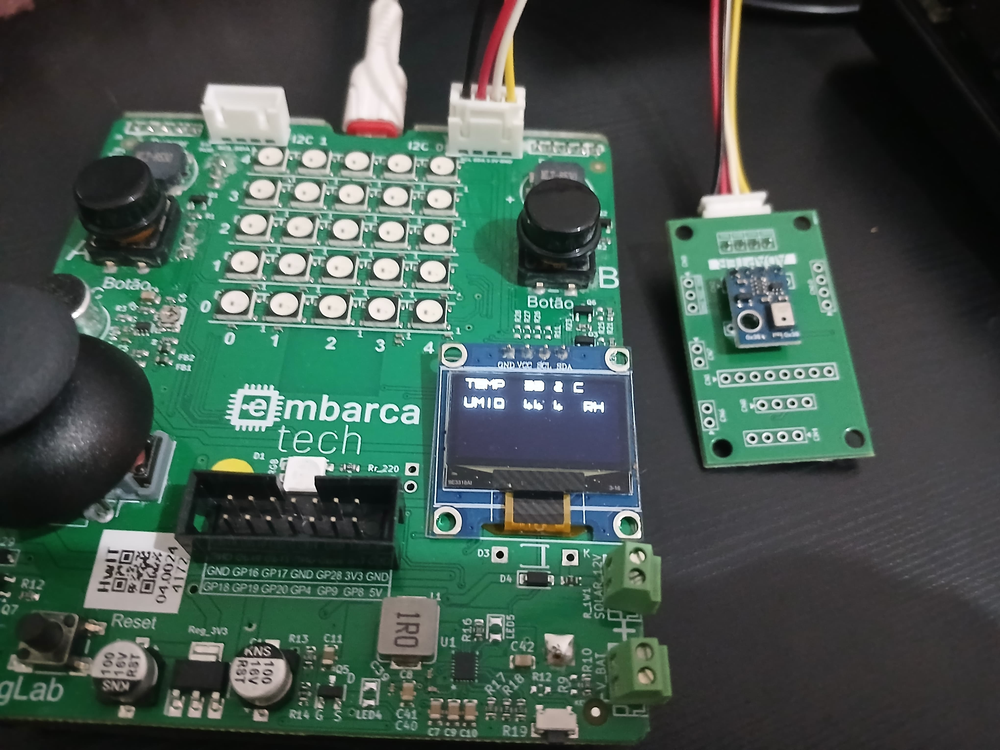

# ⚙️ Controle de LED com sensor de luminosidade
*Projeto de automação com BitDogLab e sensor de temperatura – Residência Tecnológica em Software Embarcado (Unidade 3)*

## 🚀 Funcionalidades  
- Detectação da temperatura e humidade da ambiente
- Mostra o resultado da leitura dos dados no display OLED da placa
- Os dados são exibidos em tempo real  

## 🛠️ Tecnologias  

  
  

## 🔌 Hardware Necessário  
- BitDogLab 
- Sensor de temperatura e humidade PIR (BMP280)
- Display OLED

## 🖼️ Demonstração

