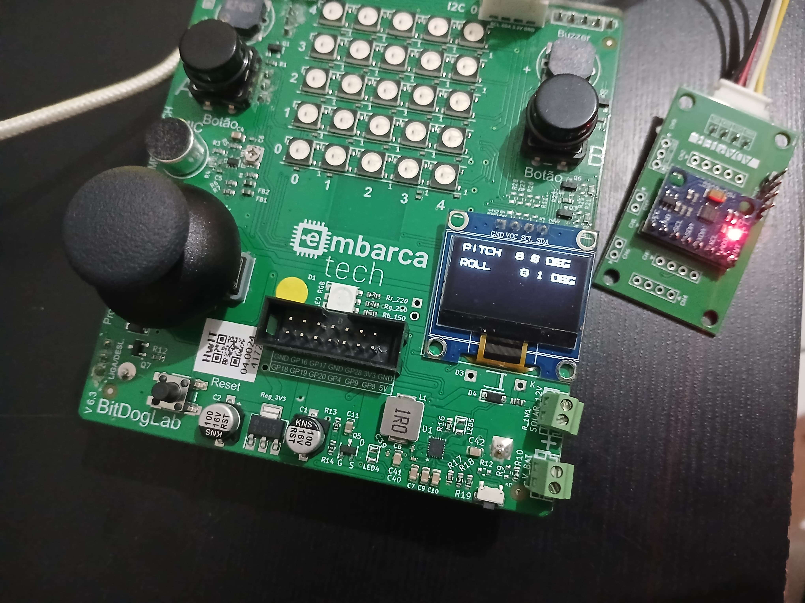

# ⚙️ Controle e Monitoramento de Movimento com MPU6050
*Projeto de automação com BitDogLab e acelerômetro para captação de movimento – Residência Tecnológica em Software Embarcado (Unidade 3)*

## 🚀 Funcionalidades  
- captar dados de movimento, como aceleração rotação, e exibir as leituras de inclinação no monitor serial
- Mostra o resultado da leitura dos dados no display OLED da placa
- Os dados são exibidos em tempo real  

## 🛠️ Tecnologias  

  
  

## 🔌 Hardware Necessário  
- BitDogLab 
- Sensor acelerômetro (MPU6050)
- Display OLED

## 🖼️ Demonstração

 
 

**Desenvolvido por** [Victor Sarris](https://github.com/Victor-Sarris)  
*Projeto acadêmico - EmbarcaTech 2025*
