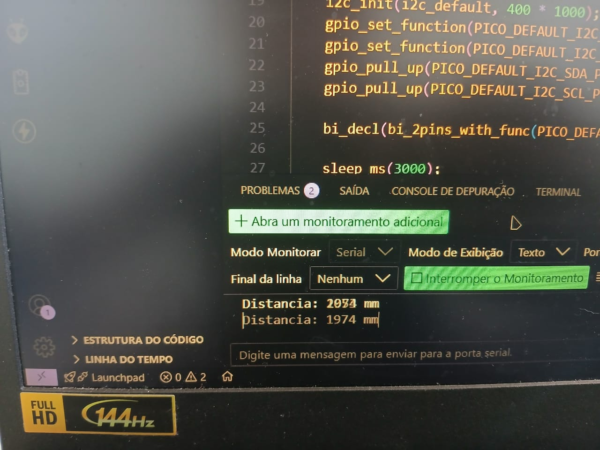
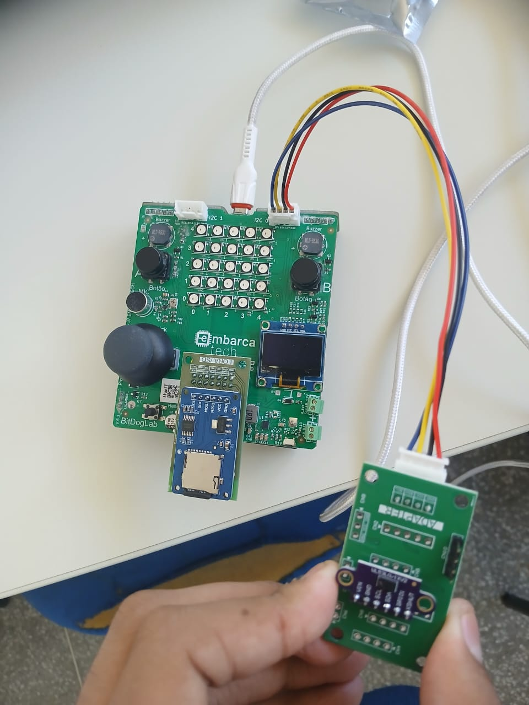

# ⚙️ Capitação de distância com VL53L0X e SDCARD
*Projeto de automação com BitDogLab, sensor de disntância e armazenamento de dados – Residência Tecnológica em Software Embarcado (Unidade 3)*

## 🚀 Funcionalidades  
- captar dados de distância e exibir as leituras no monitor serial
- Os dados são guardados no sdcard para análise posterior
- Os dados são exibidos em tempo real  

## 🛠️ Tecnologias  

  
  

## 🔌 Hardware Necessário  
- BitDogLab 
- Sensor de distância VL53L0X
- SDCARD

## 🖼️ Demonstração

 
 

**Desenvolvido por** [Victor Sarris](https://github.com/Victor-Sarris)  
*Projeto acadêmico - EmbarcaTech 2025*
